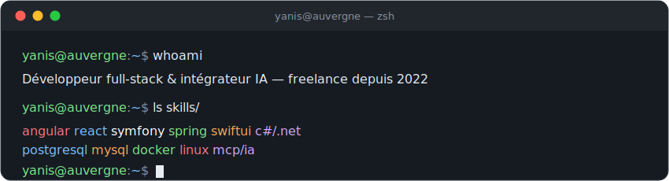
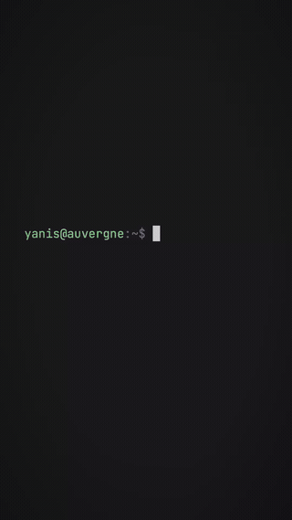

<!-- Bannière terminal animée (SVG custom, à committer dans assets/) -->

<!-- Texte défilant animé -->

## 🛠️ Stack

## 🔭 En ce moment

- **Scraper Max** — serveur MCP + agent IA : collecte et structuration de données B2B (cache multi-niveaux, observabilité, RGPD)
- **Logiciel métier** de suivi de réparations pour un atelier d'optique astronomique (Symfony / Angular)

## 🐍 Contributions

<!-- Générée par l'action snk (voir .github/workflows/snake.yml) -->

*« Comprendre le métier avant d'écrire du code. »*

## 🎬 En vidéo

<!-- GIF en boucle (lecture auto inline sur GitHub). Version vidéo HD + son via le lien dessous. -->

*[▶️ Version vidéo — HD &amp; son](https://raw.githubusercontent.com/Yaniis/Yaniis/main/assets/presentation.mp4)*

