<div align="center">

<!-- Bannière animée personnalisée (réseau de neurones) -->


<!-- Effet machine à écrire -->
<a href="https://github.com/VOTRE-PSEUDO">
  
</a>

</div>

---

## 🧠 À propos

```python
class Developer:
    def __init__(self):
        self.name = "Votre Nom"
        self.focus = ["Intelligence Artificielle", "Machine Learning", "Automatisation"]
        self.learning = "toujours quelque chose de nouveau"

    def say_hi(self):
        print("Merci de passer sur mon profil ! 🚀")

Developer().say_hi()
```

## 🛠️ Stack technique

<div align="center">

### Langages


### IA & Data


### Outils & Infra


</div>

## 📊 Statistiques

<div align="center">


</div>

## 🐍 Contributions

<div align="center">

</div>

## 📫 Me contacter

<div align="center">

[](https://linkedin.com/in/VOTRE-PROFIL)
[](mailto:votre@email.com)
[](https://votre-site.com)


</div>
